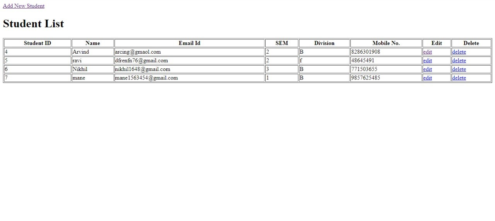
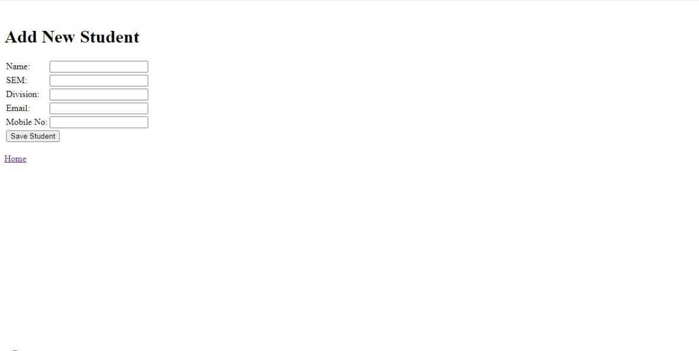
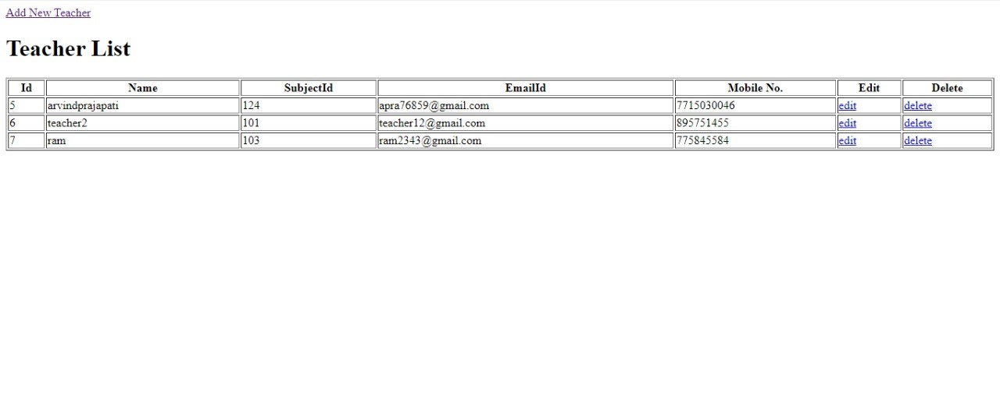
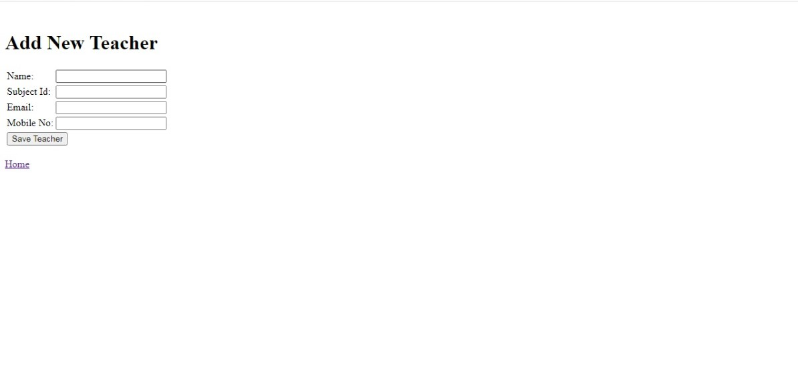
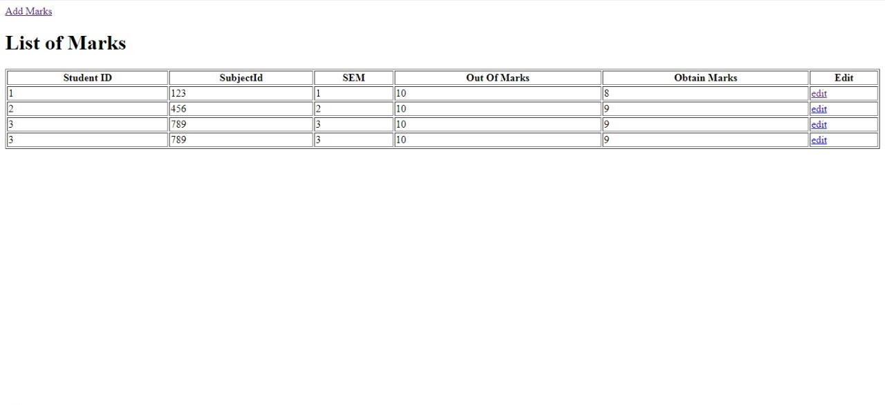
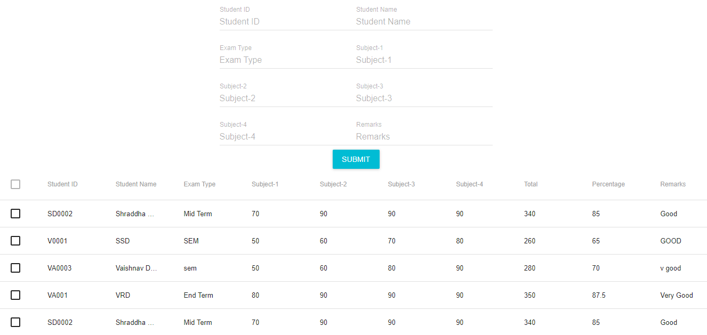
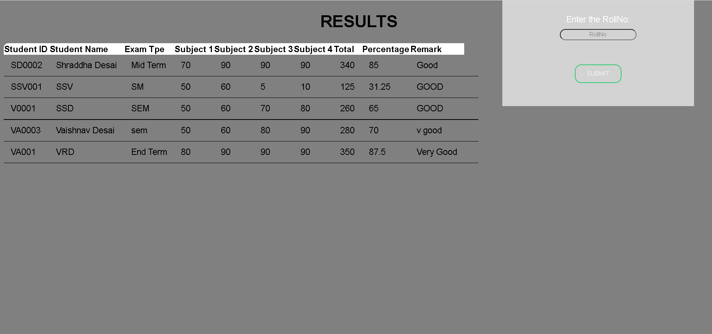
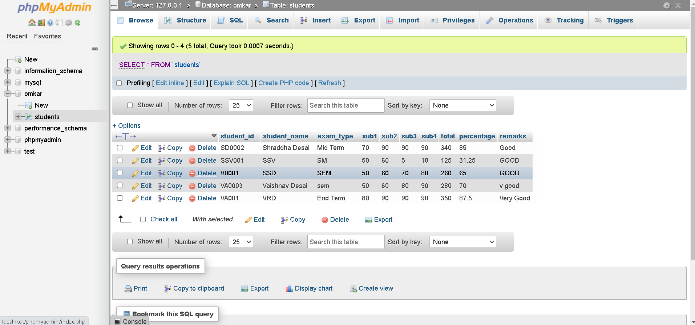

# _Group-12_

## _Problem Statement: Exam Performance Module_

## **_Contribution_**
- @Arvind77150 - _apra76859@gmail.com_
   1. Leaded the backend Team.
   2. Created the Teacher & Admin Database using HTML, JAVA and Servlet and MySQL technology language.

- @Ptare07 - _tareprajyot@gmail.com_
   1. Leaded the Front-end.
   2. Created the Login Page along with @Arvind77150
   3. Made a front-end of students dashboard where the New register and login is there.

- @Prathamesh2712 - _prathameshmane47@gmail.com_
   1. Complete Database work and Documentation Work along with @Nikhil23108
   
- @Nikhil23108 - _nikhillandge2000@gmail.com_
   1. Created database schematics on the basis of which @Prathamesh2712 created the pages.

- @Hrithikkanojia - _hrithikkanojia21300@gmail.com_
   1. Decided what actors should be there in system ect.

---

- @Vaishnav6818 - _vaishnavdesai45@gmail.com_
   1. Explored about React js, Node js & MySQL workbench.
   2. Designed and worked on the database Back-end for teachers module using MySQL workbench.
   3. Designed and worked on the Front-end for teachers module along with @NidhiTirpude & @Merudesiddhant 
   
- @NidhiTirpude - _nidhinai15@gmail.com_
   1. Designed schema, ER diagram and worked on Documentation.
   2. Designed and worked on Front-end for teachers module using Reactjs & Nodejs with @Vaishnav6818 & @Merudesiddhant 
   3. Worked on creating the code for the API to insert data into MySQL Workbench database with other team members.
   
- @Merudesiddhant - _siddhantmerude47@gmail.com_
   1. Worked on database with @Vaishnav6818 
   2. Worked on Front-end with @NidhiTirpude & @Vaishnav6818

- @Ankitkamble - _ankitkamble632@gmail.com_
   1. Researched about the task given.
   2. Worked on API with @NidihiTirpude & @JayKhot333

- @JayKhot333 - _jaykhot2000@gmail.com_
   1. Decided the actors for the task.
   2. Worked on API with @NidihiTirpude & @Ankitkamble

---

- @OmkarDambale02 - _omdambale@gmail.com_
   1. Explored about MySQL & PHP Server.
   2. Designed and created Front-end of Students module and login page for viewing results.

- @Asif07 - _ak668789@gmail.com_
   1. Designed the database schema and tables required for students module.
   2. Created the Admin database.
   
- @PanchalVipul - _vipulpanchal899@gmail.com_
   1. Researched and suggested various sources and references.

- @spoojari70 - _sairajpoojari1@gmail.com_
   1. Worked on CSS for front-end of students module and documentation work.
   
- @PrasadGulekar97 - _prasadgulekar97@gmail.com_
   1.Decided what actors should be there in system.
  
---

## **_Technologies Used_**
1. V1: HTML, JAVA, Servlet, MySQL
2. V2: React js, Node js, MySQL Workbench
3. V3: Front-end- PHP Server, Back-end- MySQL

---

## **_Screenshots_**
- **Teachers Module using HTML, JAVA, Servlet, MySQL**
   
   i. Teachers Dashboard
 

   2. View Students List

   
   3. Add Students

   4. View Teachers List

   5. Add Teachers

   6. Add Marks

   7. View Marks

---

- **Teachers Module using React js, Node js, MySQL Workbench**

   1. Teachers Dashboard

---

- **Students Module using Front-end- PHP Server, Back-end- MySQL**
   
   1. Students Dashboard

   2. Students Database in MySQL

---

## **Note:**
Everyone in team discussed & used their own logic and came up with their different or same solution. First we tried to learn React js , Node js and started woking on the same. Because of lack of knowledge, errors and problems occured using Reactjs some members started working on HTML, JAVA Servlet, PHP server & MySql and created the dashboards for teachers and students module and also we kept working on reactjs . At the end we decided to push all the codes on gitHub repository

---
